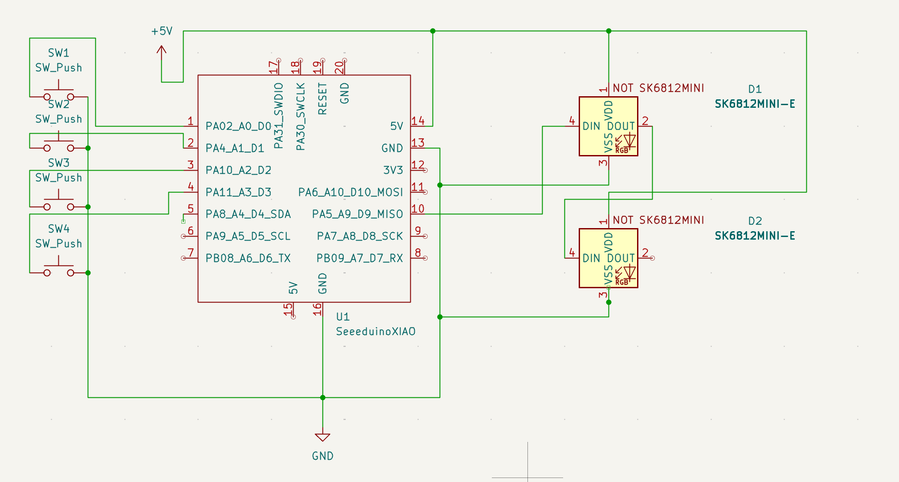
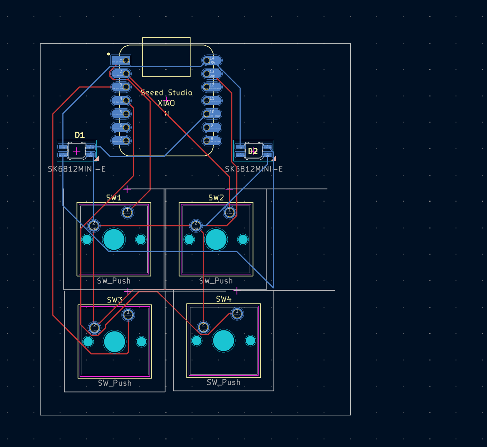
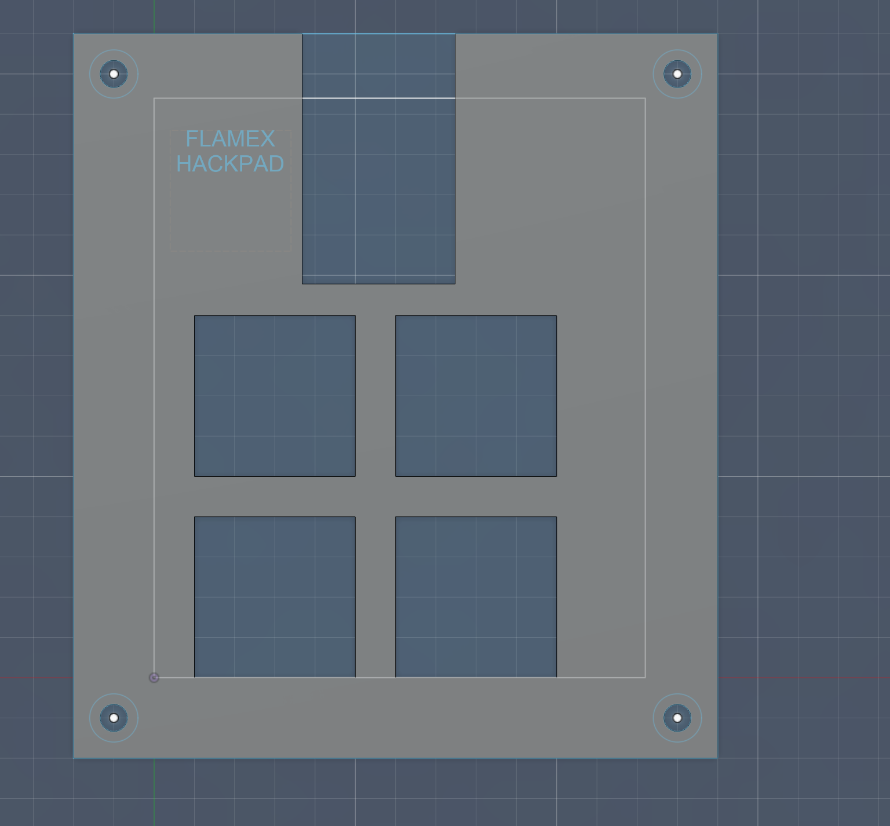

# FLAMExPAD 🔥

**BUILT TO LAST.**

FLAMExPAD is a minimal 4-key macropad powered by [KMK](http://kmk.fyi) firmware on a Seeeduino XIAO (SAMD21). It features 2 SK6812MINI-E RGB LEDs, a clean 2-layer keymap with Spotlight macros for launching apps, and a compact direct-wired design — no diodes, no encoder, no display. Just keys that *do things*.

Built for the [Hackpad Blueprint](https://hackpad.hackclub.com/) YSWS by Hack Club.

---

## Features
- 🔥 4 Cherry MX mechanical keys — direct wired, no diodes needed
- 💡 2x SK6812MINI-E RGB LEDs — daisy-chained underglow
- 🧠 [KMK Firmware](http://kmk.fyi) on CircuitPython — fully hardcoded, no companion app
- 🔀 2 Layers — tap/hold layer switching on K4
- 🚀 Spotlight macros — launch Photo Booth, Spotify, VS Code, and Brave instantly
- 🔌 USB powered — plug and go

---

## Keymap

### Layer 0 (Default)

| Key | Action |
|-----|--------|
| **K1** | `Ctrl + `` ` |
| **K2** | `F5` |
| **K3** | Macro: Open **Photo Booth** via Spotlight |
| **K4** | Tap: `Cmd+S` · Hold: Momentary Layer 1 |

### Layer 1 (Momentary — hold K4)

| Key | Action |
|-----|--------|
| **K1** | Macro: Open **Spotify** via Spotlight |
| **K2** | Macro: Open **Visual Studio Code** via Spotlight |
| **K3** | Macro: Open **Brave** via Spotlight |
| **K4** | Transparent (layer hold passes through) |

> All macros follow the pattern: `Cmd+Space` → 200ms delay → type app name → 150ms delay → `Enter`

---

## PCB

The PCB was designed in **KiCad**. Direct wiring to the Seeeduino XIAO — no key matrix, no diodes. The two SK6812MINI-E LEDs are daisy-chained from pin D9.

**Schematic**



**PCB Render**



### Pin Assignments

| Component | XIAO Pin | GPIO |
|-----------|----------|------|
| SW1 | Pin 1 | D0 (PA02) |
| SW2 | Pin 2 | D1 (PA4) |
| SW3 | Pin 3 | D2 (PA10) |
| SW4 | Pin 5 | D4 (PA8) |
| LED Data (D1 DIN) | Pin 10 | D9 (PA5) |
| LED D1 DOUT → D2 DIN | Daisy-chained | — |
| LED VDD | 5V | — |
| LED VSS | GND | — |

---

## CAD Model

The case was designed in **Fusion 360**. Two-part design: a top plate and a bottom enclosure.



---

## Firmware Overview

FLAMExPAD runs [KMK](http://kmk.fyi) firmware on CircuitPython. Everything is hardcoded — no VIA, no companion app.

- **Framework:** KMK (CircuitPython-based keyboard firmware)
- **Board:** Seeeduino XIAO (SAMD21)
- **Layers:** 2 (momentary switching via hold on K4)
- **Macros:** Spotlight-based app launchers with configurable delays
- **RGB:** Static color on 2 daisy-chained SK6812MINI-E LEDs

### File Structure

```
firmware/
├── boot.py     # USB HID device configuration
├── kb.py       # Hardware definition (pins, scanner, RGB pin)
└── main.py     # Keymap, layers, macros, RGB config
```

### Setup Instructions

1. **Flash CircuitPython** onto your Seeeduino XIAO (SAMD21) from [circuitpython.org](https://circuitpython.org/board/seeeduino_xiao/)
2. Copy the **`kmk/`** folder from [KMKfw/kmk_firmware](https://github.com/KMKfw/kmk_firmware) to the root of your `CIRCUITPY` drive
3. Copy **`neopixel.mpy`** from the [CircuitPython library bundle](https://circuitpython.org/libraries) into `CIRCUITPY/lib/`
4. Copy `boot.py`, `kb.py`, and `main.py` from the `firmware/` folder to the root of `CIRCUITPY`
5. Unplug and replug — you're done! 🔥

---

## BOM

| Qty | Component |
|-----|-----------|
| 4x | Cherry MX Switches |
| 4x | Blank DSA Keycaps |
| 2x | SK6812MINI-E RGB LEDs |
| 1x | Seeeduino XIAO (SAMD21) |
| 1x | Custom PCB |
| 1x | Case (2 parts — 3D printed in Fusion 360) |

---

## Fun Facts & Lessons Learned 🧠

- 🔄 Changed the **entire build three times** because I had no idea what half the components were actually for. Trial by fire (fitting for FLAMExPAD).
- 🌅 Started on **March 2nd morning**, finished at **March 3rd, 2 AM**. One long session.
- 📅 First attempt at Blueprint was back in **December** — but it was way too overwhelming at first. Came back stronger.
- 🔮 **Future plans:** More firmware layers, maybe an encoder or OLED in v2. The foundation is solid.

> "If at first you don't succeed, redesign it three more times." — Me, probably at 1 AM

---

## Credits & Resources

- [KMK Firmware](https://github.com/KMKfw/kmk_firmware) — The CircuitPython keyboard framework
- [Orpheuspad](https://github.com/hackclub/hackpad/tree/main/hackpads/orpheuspad) — The reference hackpad that inspired this build
- [Hack Club Hackpad](https://hackpad.hackclub.com/) — The YSWS that started it all
- [CircuitPython](https://circuitpython.org/) — The Python runtime for microcontrollers
- [KiCad](https://www.kicad.org/) — PCB design
- [Fusion 360](https://www.autodesk.com/products/fusion-360/) — Case CAD design
